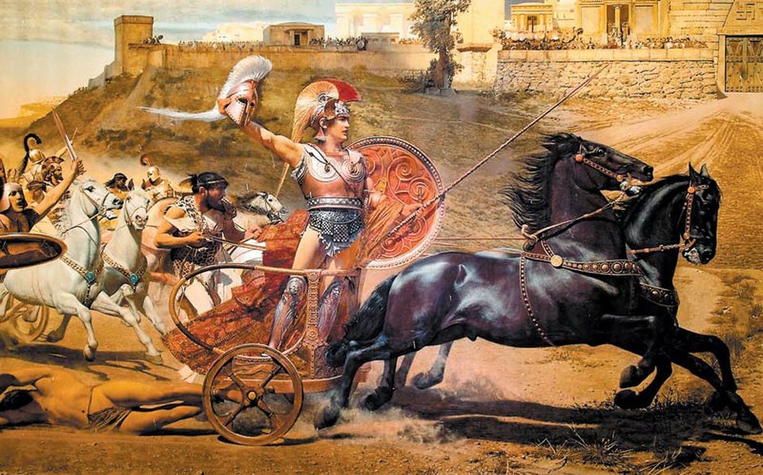

# Encode-text-in-images--Steganographic-web-app
This project is a responsive web app that can encode (decode too, if it was encoded the same way) a message/text into a picture.  
It changes only the last digits of rgb value of each pixel. 

### How it works:
#### *Encoding:*
For easier storing, the message is converted as follows: message => characters => ASCI codes => binary  
After the image is uploaded it is drawn into a canvas from which the picture information is extracted by javascript function *getImageData*. 
Then each pixels rgb values are changed either to zero or 1 based on binary message. I tried to change the alpha value as well but it resulted in image correction which destroyed the message.  
The first and last rgb values (before and after message) are 5. This makes it easeier to decode because then javascript will not try to decode things that aren't messages.  

#### *Decoding:*  
Decoding works very similarly. Image is uploaded, sent into canvas, *getImageData*...  
Then I cycle through all rgb values and after I encounter one ending with 5 I start recording binary numbers. After another 5 appears I stop and convert binary into message.

### Examples:
*Before image:*  
  
*After image:*  
  
*Message:*  
More than 120 lines of Illiad

### Things to do:  
1. Show how much more space you have for your text based on image size
2. Encryption
3. Password protection

If you have any ideas or see any bugs please contact me via email on: olimail111@gmail.com
